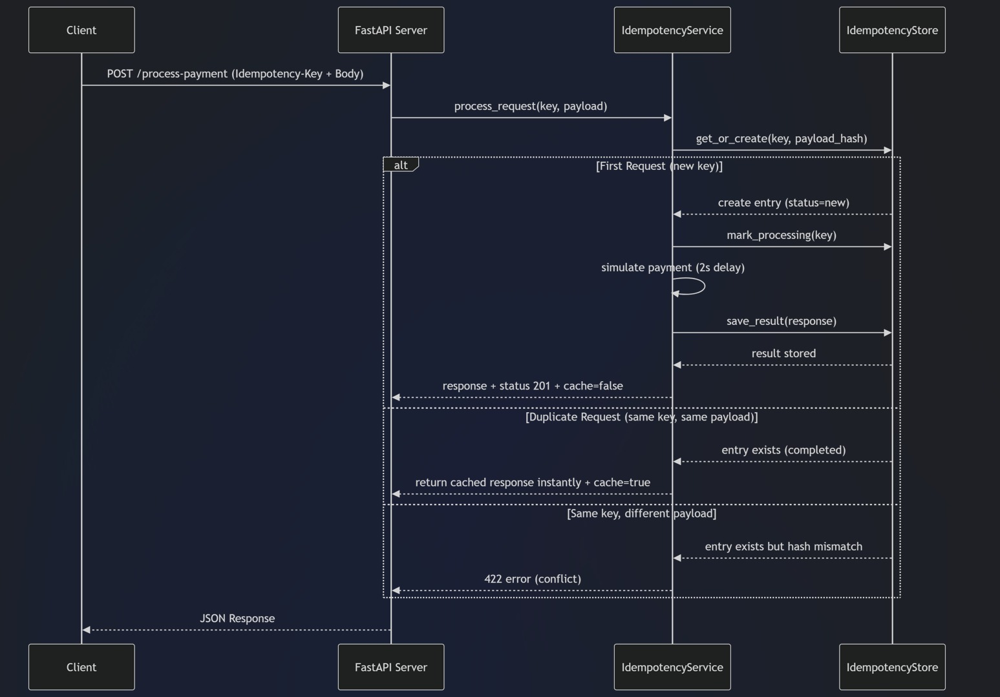

# 🚀 Idempotency Gateway (Pay-Once Protocol)

A FinTech-grade backend system that ensures **exactly-once payment processing** using an Idempotency-Key mechanism. This prevents duplicate charges caused by network retries or timeouts.

---

# 📌 Problem Statement

In real-world payment systems, network failures often cause clients to retry requests. Without protection, this leads to **double charging customers**.

This system solves that by ensuring:

- Same request (same Idempotency-Key) → processed only once  
- Retry requests → return cached response  
- Different payload with same key → rejected  

---

# 🧠 Core Concept

The system implements an **Idempotency Layer** that:

✔ Stores request fingerprints  
✔ Detects duplicate requests  
✔ Returns cached responses instantly  
✔ Prevents conflicting payload reuse  
✔ Handles race conditions safely  

---

# 🏗️ Architecture

The system follows a clean layered architecture:

Client → FastAPI API Layer → Service Layer → Idempotency Store

---

# 📊 Architecture / Sequence Diagram




---

# ⚙️ Features

## Core Features

- Idempotency-Key based request deduplication  
- Async-safe processing (race condition handling)  
- Cached response replay  
- Payload hashing validation  
- Conflict detection (security layer)  

## Advanced Features

- In-flight request blocking  
- Async event synchronization  
- Request fingerprinting using SHA256  

---

# 🧪 API Documentation

## Endpoint

### POST /process-payment

Processes a payment request safely using idempotency logic.

---

## Headers

| Key | Type | Required |
|-----|------|----------|
| Idempotency-Key | string | Yes |

---

## Request Body

```json
{
  "amount": 100,
  "currency": "GHS"
}


Responses
First Request (Processed)
{
  "status": "Charged 100 GHS"
}

Header:

X-Cache-Hit: false
Duplicate Request (Cached)
{
  "status": "Charged 100 GHS"
}

Header:

X-Cache-Hit: true
Invalid Reuse of Key
{
  "detail": "Idempotency key already used for a different request body."
}

Status Code:

422 Unprocessable Entity

 Tech Stack:

Python 3.10+
FastAPI
Uvicorn
AsyncIO


Project Structure:


idempotency-gateway/
│
├── app/
│   ├── main.py
│   ├── api/
│   │   └── payment.py
│   ├── services/
│   │   └── idempotency_service.py
│   ├── store/
│   │   └── idempotency_store.py
│   └── utils/
│       └── hash_utils.py
│
├── tests/
│   └── test_idempotency.py
│
├── app.py
├── requirements.txt
├── README.md
└── LICENSE


Design Decisions
1. In-Memory Store

Used for simplicity and fast lookup. Can be replaced with Redis in production.

2. SHA256 Payload Hashing

Ensures request integrity and detects payload changes.

3. Async Locking

Prevents race conditions when multiple identical requests arrive simultaneously.

4. Event-Based Waiting

Duplicate requests wait instead of reprocessing logic.


Bonus Feature (Developer Choice)
Payload Integrity Enforcement

Implemented payload hashing validation to ensure:

Idempotency-Key cannot be reused with different payload
Prevents accidental or malicious misuse
Why this matters:

Prevents:

Fraudulent retries
Payment mismatches
Data corruption
🧪 How to Run
Install dependencies
pip install -r requirements.txt
Start server
python -m uvicorn app.main:app --reload
Open API docs
http://127.0.0.1:8000/docs
🧪 Testing Flow
Step 1

Send request with new Idempotency-Key → processed normally

Step 2

Repeat same request → returns cached response instantly

Step 3

Reuse key with different payload → returns 422 error

🔥 Key Learning Outcomes
Idempotency in distributed systems
Race condition handling
Async Python backend design
Payment system safety design
API architecture layering
📌 Author

Fabrice NDAYISABA

Built as part of a FinTech backend engineering challenge.


---


Just say 👍


